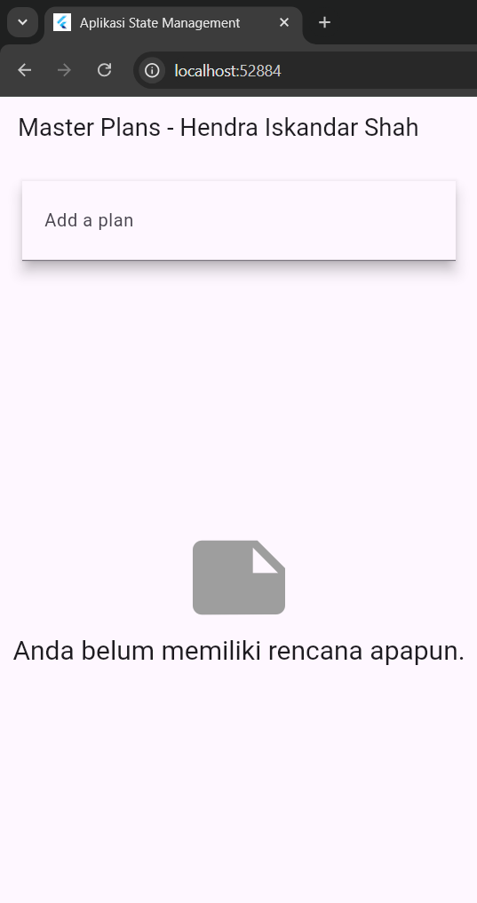
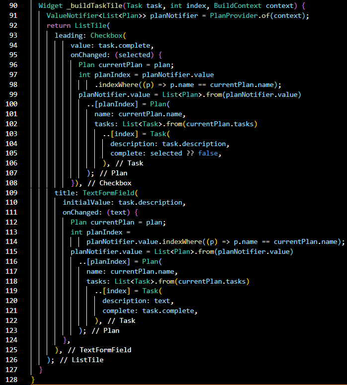

# Hasil dari project

## Tugas Praktikum 1
1. Jelaskan maksud dari langkah 4 pada praktikum tersebut! Mengapa dilakukan demikian?
Karena langkah 4 ini bertujuan untuk menyederhanakan proses impor-impor model pada file-file lain dalam aplikasi. Dengan membuat file bernama data_layer.dart, yang berfungsi sebagai pembungkus untuk mengimpor beberapa model sekaligus, kita bisa lebih mudah mengelola dan mengimpor berbagai model dalam satu kali impor.

2. Mengapa perlu variabel plan di langkah 6 pada praktikum tersebut? Mengapa dibuat konstanta?
Karena variabel plan di langkah 6 yaitu berfungsi sebagai instance atau kondisi dari model Plan yang akan digunakan di dalam kelas _PlanScreenState, Ini merupakan objek yang menyimpan data terkait rencana yang akan ditampilkan atau dimanipulasi dalam antarmuka pengguna.

3. Lakukan capture hasil dari Langkah 9 berupa GIF, kemudian jelaskan apa yang telah Anda buat!

Widget "_buildTaskTile" akan menampilkan daftar tugas dalam bentuk List Tile dengan checkbox untuk status selesai dan Text From Field untuk deskripsi tugas. Ketika pengguna atau user mengubah status atau deskripsi tugas, maka tampilan akan diperbarui secara langsung.

4. Apa kegunaan method pada Langkah 11 dan 13 dalam Lifecyle State?

a). initState() digunakan sebagai inisialisasi ScrollController dan menambahkan listener untuk menutup keyboard saat di scroll
b). dispose() digunakan sebagai membersihkan ScrollController ketika widget sudah tidak lagi digunakan, untuk menghindari memory leak atau kebocoran memori dan menjaga performa aplikasi.